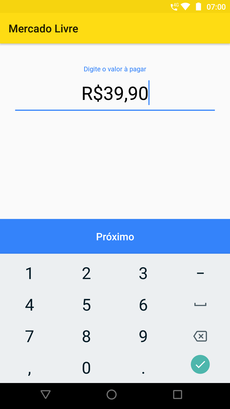
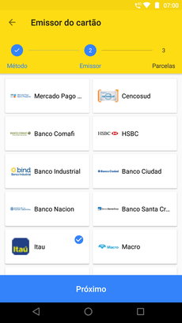
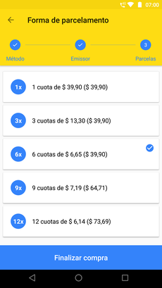

# Mercado Livre

Android app developed with Clean architecture approach using the Mercado Livre API

## Showcase







## Support

- Minimum: `SDK 16` `Android 4.1` `Jelly Bean`
- Target: `SDK 28` `Android 9` `Pie`

## Running the tests

To run the tests locally, execute from your command line:

```sh
git clone https://github.com/lucasrafagnin/MercadoLivre.git
cd MercadoLivre
./gradlew test
./gradlew connectedAndroidTest
```

## Dependencies

* [Dagger2](https://github.com/google/dagger) - Dependency injector
* [Retrofit](https://github.com/square/retrofit) - Http client
* [RxJava](https://github.com/ReactiveX/RxJava) - Reactive extensions

All dependencies [here](libraries.gradle)

## Improvements

- Add more Instrumentation tests
- Add support to landscape orientation

